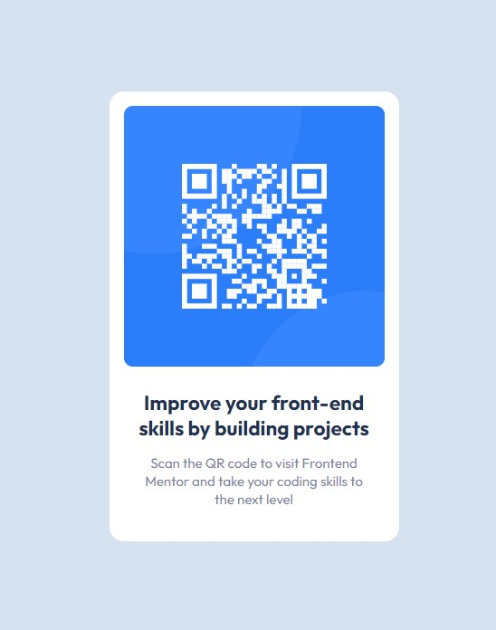

# Frontend Mentor - QR code component solution

This is a solution to the [QR code component challenge on Frontend Mentor](https://www.frontendmentor.io/challenges/qr-code-component-iux_sIO_H). Frontend Mentor challenges help you improve your coding skills by building realistic projects. 

## Table of contents

- [Overview](#overview)
  - [Screenshot](#screenshot)
  - [Links](#links)
- [My process](#my-process)
  - [Built with](#built-with)
  - [What I learned](#what-i-learned)
- [Author](#author)

## Overview

### Screenshot

### Links

- Solution URL: [GitHub](https://github.com/DekhanFraser/FM-NB-QR-code-component)
- Live Site URL: [Netlify](https://papaya-sawine-e42a65.netlify.app/)

## My process

### Built with

- Semantic HTML5 markup
- CSS custom properties
- CSS Grid
- Mobile-first workflow

### What I learned

This was a simpler project than the product card I did as my first guided attempt, however, I did this one entirely on my own. There were a few minor snags I found that I could not quite put my finger on as I hade a scroll bar appear on my page despite the content being centered. Turned out I accidently put a *margin* attribute on the *body* instead of *padding*. Other than that, it was nice to put into practice the CSS variables and some other tips I picked up on my previous challenge. This one was built completely on my own in a matter of 2 hours.

## Author

- GitHub - [@DekhanFraser](https://github.com/DekhanFraser/)
- Frontend Mentor - [@DekhanFraser](https://www.frontendmentor.io/profile/DekhanFraser)